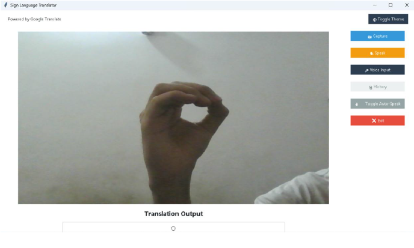

# 🧠 Real-Time American Sign Language (ASL) Translator

**Live webcam ASL alphabet detector with multi-language translation, text-to-speech, and auto-speak mode**



## ✨ Project Overview
This project is a **real-time American Sign Language (ASL) detection application** developed as part of our BS Artificial Intelligence final project at Capital University of Science & Technology (CUST), Islamabad.

It uses a webcam to detect hand signs (A–Z, space, del), predicts the letter using a custom-trained deep learning model, translates it into multiple languages, and speaks it out loud — making communication easier for Deaf and Hard-of-Hearing individuals.

## 🚀 Features
- ✅ Real-time hand sign detection (A–Z + space + delete)
- ✅ Live video feed with MediaPipe landmarks
- ✅ Instant translation to 6 languages (English, Urdu, French, Spanish, Chinese, Arabic)
- ✅ Text-to-Speech (pyttsx3) with **Auto-Speak** toggle
- ✅ Voice input support
- ✅ Translation history
- ✅ Screenshot capture
- ✅ Light/Dark theme toggle
- ✅ Clean and user-friendly GUI (Tkinter + ttkbootstrap)

## 🛠 Technologies Used
| Component              | Technology                          |
|------------------------|-------------------------------------|
| Hand Landmark Detection| MediaPipe                          |
| Model                  | TensorFlow/Keras MLP               |
| GUI                    | Tkinter + ttkbootstrap             |
| Webcam & Image         | OpenCV + Pillow                    |
| Translation            | Google Translate API               |
| Text-to-Speech         | pyttsx3                            |
| Voice Input            | SpeechRecognition                  |
| Training               | Kaggle + Google Colab              |

## 📊 Model Details
- **Model Type**: Multi-Layer Perceptron (MLP)
- **Input**: 63 normalized hand landmarks (21 points × x, y, z)
- **Architecture**:
  - Input → Dense(128, ReLU) → Dropout(0.4)
  - Dense(64, ReLU) → Dropout(0.3)
  - Output → Dense(28, Softmax)
- **Training Method**: Incremental training on 6 subsets of the 90,000+ image ASL dataset to avoid memory issues and overfitting
- **Final Model File**: `asl_mlp_final_trained.keras`
- **Achieved Accuracy**: Very high (near-perfect on validation set)

## 📁 Project Structure
sign-language-translator/
├── App.py                          ← Main GUI application
├── asl_mlp_final_trained.keras     ← Trained model (248 KB)
├── class_indices_dataset1.json     ← Label mapping
├── requirements.txt
├── train_model.py                  ← Training script (reference)
└── README.md

## 🧪 How to Run Locally

1. Clone the repository:
   ```bash
   git clone https://github.com/yourusername/sign-language-translator.git
   cd sign-language-translator
   ```
   Install dependencies:
   ```bash
   pip install -r requirements.txt
   ```
   Run the application:
   ```bash
   python App.py
   ```
